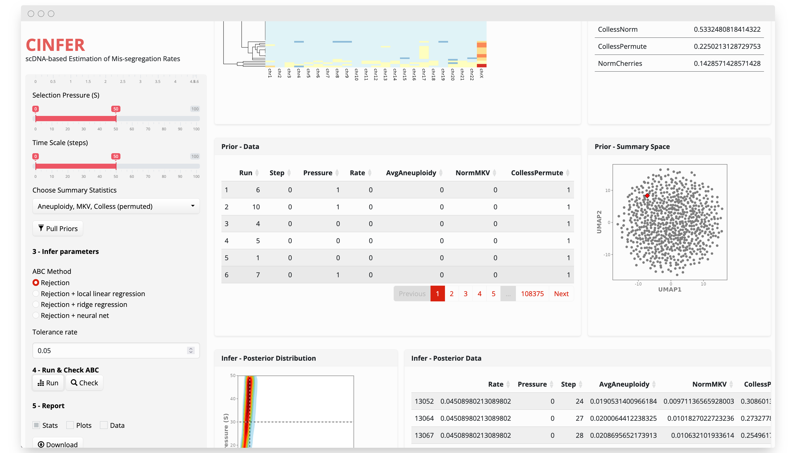

# CINFER

[CINFER](https://burkardlab.shinyapps.io/CINFER/) produces scDNAseq-based estimates of chromosome mis-segregation rates. It uses a pre-simulated dataset of over 50,000 simulated populations growing with varying levels of chromosomal instability and selective pressure of aneuploid populations.

